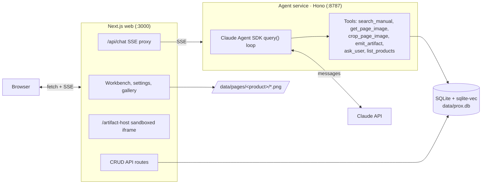

# Prox: an AI product specialist


## What this is

This is my submission for the Prox founding engineer challenge. The brief asked
for a multimodal agent that answers questions about the welder accurately and not
only in text. I treated it as a chance to reconstruct how a product like Prox
might actually work from end to end, based on what I understood of it, rather than
only satisfying the brief.

So beyond the required parts (grounded answers, surfaced manual pages, generated
interactive artifacts), I built several agentic features the brief didn't ask for:

- The agent asks clarifying questions before answering when a choice would change
  the result, and those questions can carry their own little diagrams.
- Artifacts are interactive and revisable. Ask for a change and the agent
  republishes a new version you can flip between, so the conversation drives the
  tool.
- Chat history is saved, and you can edit an earlier message to branch the
  conversation without losing the original.
- Voice input and spoken answers, image attachments, a per-product artifact
  gallery, multi-product support, and provider/model management from the UI.


## Demos

Full walkthrough (click to play):

[](https://drive.google.com/file/d/1-kyqqg_7HIGBpc-uVfyB76p8DjTFWzoc/view)

### Clarifying questions

When a choice would change the answer, the agent asks first, with a diagram to help you choose.

[](https://drive.google.com/file/d/1uFOVwR8SjcfLGmuLmBLKoa4Zaal4aGXF/view)

### Interactive artifacts

[](https://drive.google.com/file/d/1Wu5gr2_W6qkGN5zoCSkDjtBdysmenNpn/view)

[](https://drive.google.com/file/d/1n1-T3GdAyQ19OZ7sXwOsGpWnQjlBYjeC/view)

## Run it

You don't have to clone anything. Open https://yash3471-prox.hf.space, go to
Settings, Providers, paste your own Anthropic API key (the brief says you plug in
your own), and start asking. A free Hugging Face Space sleeps when idle, so the
first request may take 30 to 60 seconds to wake.

To run locally instead, in under two minutes:

```bash
git clone <this-fork> && cd <fork>
cp .env.example .env          # paste your ANTHROPIC_API_KEY into .env
pnpm install
pnpm dev                      # web on :3000, agent on :8787
```

Open http://localhost:3000, pick the Vulcan OmniPro 220, and ask away.

There's no `pnpm seed` step. The welder is already indexed: a key-free catalog
(`data/seed.db`) and every rendered manual page ship in the repo and load on first
boot. The one cost left is a 90 MB local embedding model that downloads the first
time you ask a question, then stays cached. Re-indexing this product or adding a
new one is a single command (see [Adding a product](#adding-a-product)).

Questions from the brief to try:

- *"What's the duty cycle for MIG welding at 200A on 240V?"*
- *"I'm getting porosity in my flux-cored welds. What should I check?"*
- *"What polarity setup do I need for TIG? Which socket does the ground clamp go in?"*

Those three plus a handful of harder ones (an exact-amperage lookup, the wiring
schematic, an ambiguous question that should make it ask first) live in
`seed/golden-questions.json`. With the app running, `pnpm smoke` fires them at the
agent and checks each answer comes back grounded, cited, and not a refusal. It's a
quick confidence check, not a test suite.

## How the agent works

Prox is built around six tools the agent calls on its own. The system prompt
gives it four standing rules, Ground, Show, Draw, and Ask, so it behaves like a
cited specialist rather than a chatbot answering from memory.

### 1. Ground: cite every fact to the page

Before stating any spec, setting, or procedure, the agent calls `search_manual`.
That embeds the question and runs a vector search over the manual's text and over
the captions written for every diagram and table. Answers carry inline citations
like `[p.12]`, and clicking one opens the exact page it came from. When the manuals
don't cover something, the agent says so instead of guessing.

### 2. Show: surface the real manual page

When an answer leans on a diagram, schematic, control-panel photo, duty-cycle
matrix, or the process-selection chart, the agent calls `get_page_image`. The page
opens in the Canvas next to the chat, and the same image goes back to the model so
it can read charts the embedded text misses. This is how image-only content like
the wiring schematic and the weld-defect photos becomes answerable. When it puts a
figure inside an artifact, `crop_page_image` cuts a pixel-accurate crop of just the
relevant region on the server, so you see the polarity sockets or the panel control,
not a whole page with tab strips and white space.

### 3. Draw: generate live interactive tools

When the answer is a calculation, a multi-step decision, or a settings lookup, the
agent writes a small self-contained React component with `emit_artifact` and it
renders live in a sandboxed frame. Examples it produces: a duty-cycle calculator, a
settings configurator (process plus material plus thickness gives wire speed and
voltage), a troubleshooting flowchart, a polarity and socket diagram. Artifacts can
import real packages (`react`, `lucide-react`, `framer-motion`, `recharts`, `d3`,
`three`) via an import map and embed actual manual images. They're also versioned:
ask for a change and you get a new version to flip between (this is one of the
parts past the brief). The code is pushed into a sandboxed iframe by `postMessage`
and runs with `allow-scripts` only (no same-origin), so model-written code can't
reach the app's cookies, DOM, or storage. Before an artifact is shown it has to
compile and pass a set of checks (real manual-image URLs, no CSS-clipped crops,
citations inline rather than boxed, no broken markup). If it fails, the agent gets
the exact problems back and re-emits, so a broken artifact never reaches you.

### 4. Ask: clarify before guessing (beyond the brief)

When a request is ambiguous, or the answer depends on a choice the agent doesn't
know yet (process, material, thickness, input voltage), it calls `ask_user`. A
multiple-choice panel appears in the chat, and each question can carry an inline
diagram (an ASCII sketch or a small React drawing) to help you choose. You answer
and it continues with a grounded response. Dismiss the panel and it proceeds with
stated defaults.

### 5. Knowing its catalog

`list_products` lets the agent report which products it can answer about. The
catalog, the retrieval index, and the tools are all keyed by product, so a new
product is a drop-in with no code change.

### Around the agent

- Voice. Talk to it and have answers read back, using the browser's built-in
  speech APIs (best in Chrome and Edge, degrades to text elsewhere). No extra keys.
- Image input. Drag a photo of your setup or a weld defect into the composer and
  the agent sees it alongside the manuals.
- Streamed reasoning and live tool activity, with a context and cost meter each turn.
- Chat history with branching. Conversations persist, and editing a message forks
  the thread so you can compare answers.
- Model management. Set your Anthropic key and pick the chat and ingestion models
  from the UI; the picker lists your account's live models. Keys are AES-encrypted
  at rest and the browser only ever sees the last four digits.
- Add a product from the UI. Upload a manual's PDFs and Prox indexes them in place.
  Before it spends anything it shows the page count, the model it'll use, and an
  estimated cost to confirm. Each new product also gets its own starter questions,
  written from its manuals.

## Architecture




Stack: Next.js 16, React 19, and Tailwind v4 for the web; the Claude Agent SDK with
Hono for the agent; better-sqlite3 with sqlite-vec for storage; Transformers.js for
local embeddings; mupdf for PDF rendering. The full SSE protocol is in
[docs/architecture.md](docs/architecture.md).

## How knowledge is extracted

Dense manuals are mostly visual: duty-cycle matrices, wiring schematics, the
process-selection chart, weld-defect photos. Plain text extraction loses all of it.
So the ingest pipeline (`pipeline/ingest`) does four things per product:

1. Render every PDF page to a PNG with mupdf.
2. Read every page with Claude vision: transcribe the text, rebuild tables as
   markdown, and describe each diagram or photo along with the question it answers.
   That caption is what makes image-only content searchable.
3. Chunk the text and captions into roughly 500-token windows, each tagged with its
   page number.
4. Embed every chunk locally with `bge-small` (Transformers.js, no API key) and
   store it in `sqlite-vec`, partitioned by product.

At query time `search_manual` embeds the question and runs nearest-neighbor search
inside that product's partition, and `get_page_image` returns the original PNG and
shows it. The page number travels the whole way, which is what keeps citations
exact. More detail in [docs/architecture.md](docs/architecture.md) and
[docs/adding-a-product.md](docs/adding-a-product.md).

## Adding a product

Nothing is hardcoded to welding. Drop a product's PDFs in a folder and run:

```bash
pnpm ingest \
  --product espresso-machine \
  --name "Acme Espresso One" \
  --manufacturer "Acme" \
  --dir ./path/to/its/pdfs \
  --hero ./path/to/photo.webp
```

Re-running is idempotent for cost: captions and chunks are cached, so unchanged
pages skip the paid vision and embedding calls and a re-run costs nothing (pages
are still re-rendered locally). The product appears in the picker right
away. To refresh the committed key-free catalog after seeding, run
`scripts/bake-seed-db.sh`.
