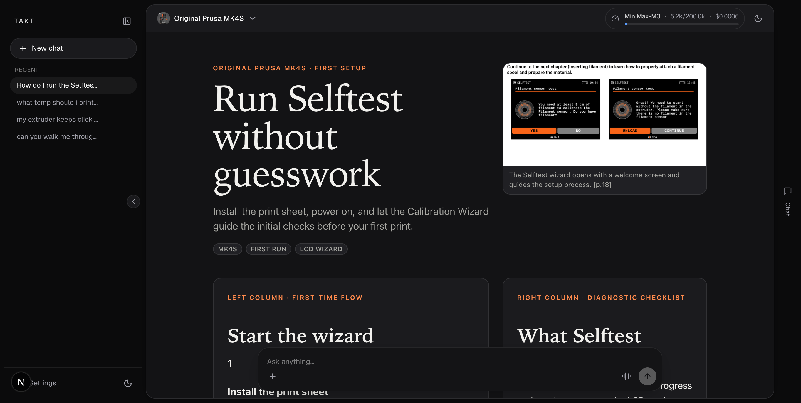
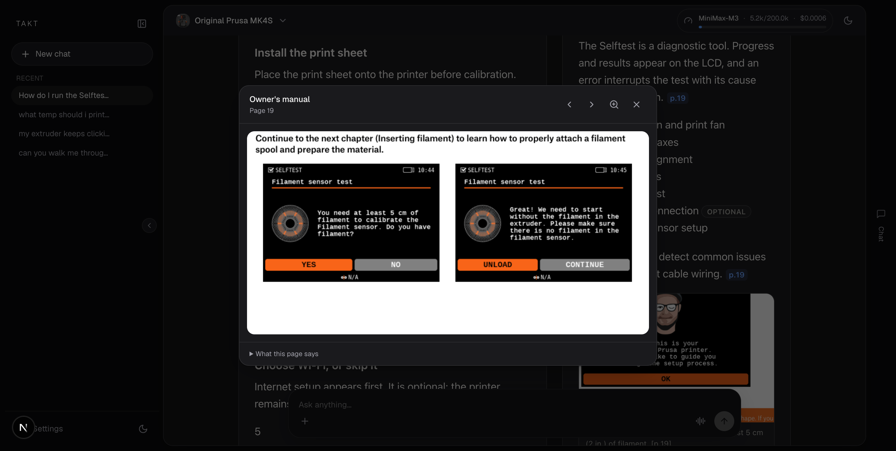
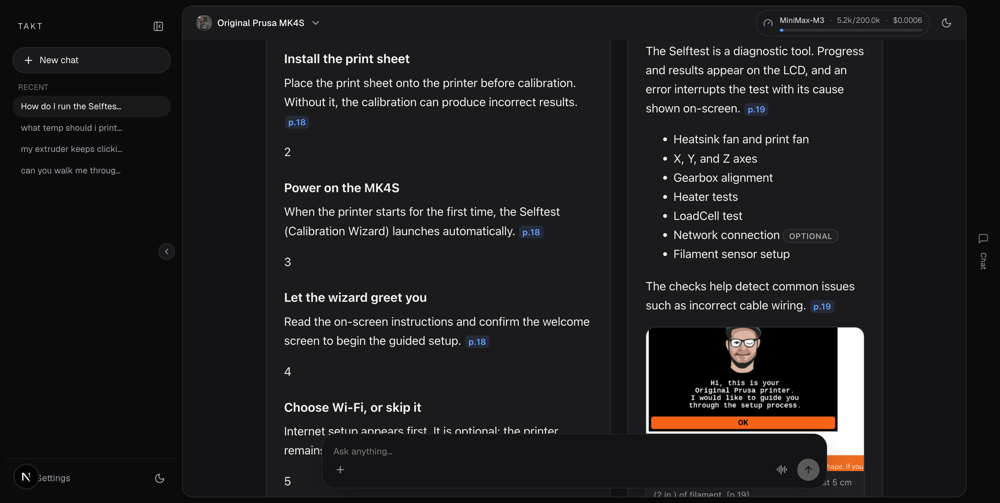
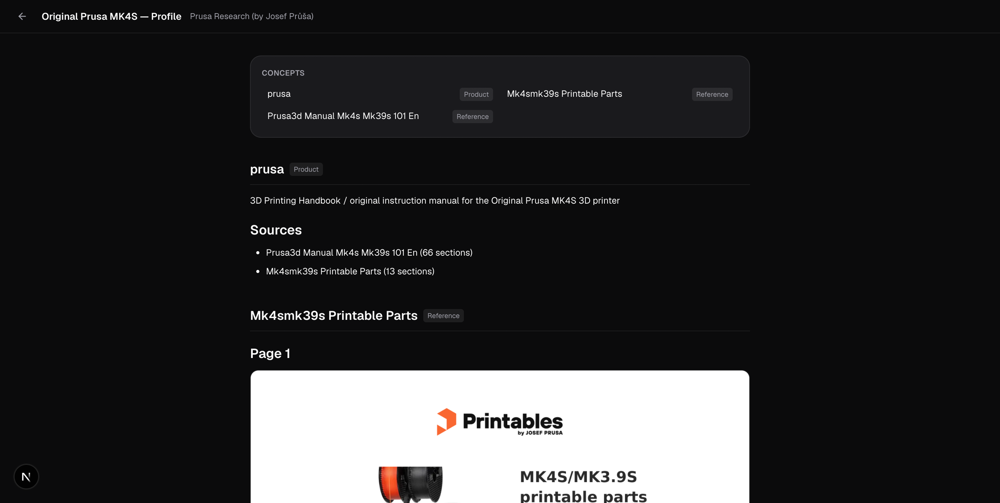
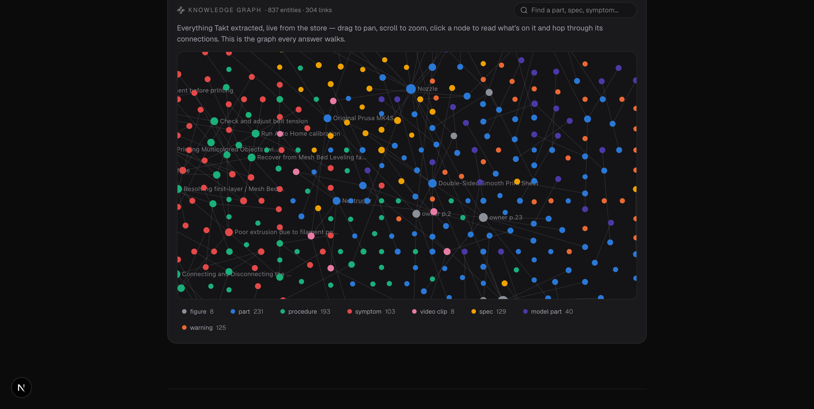
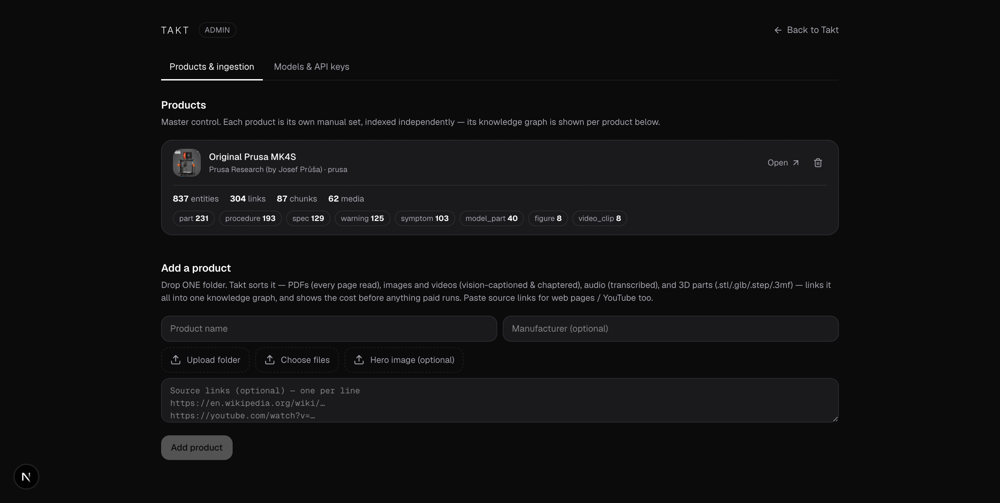
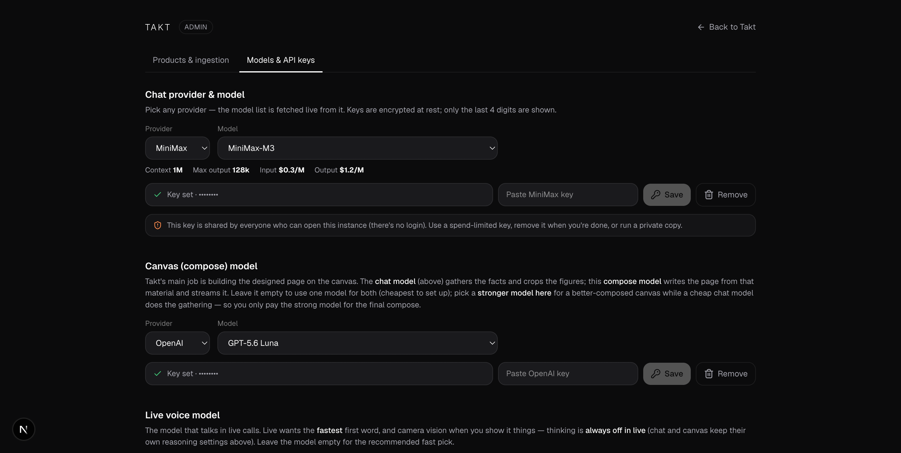

# Takt

**An AI that actually understands your product, and answers, shows, and talks like it.**

Takt takes a product's scattered docs (manuals, spec sheets, diagrams, photos, video,
3D models) and turns them into a typed knowledge graph plus readable markdown Profiles.
The graph holds parts, specs with their exact values, symptoms, procedures, and warnings,
cross-linked to the figures, 3D parts, and video clips that show them. Ask a question in
chat or by voice and you get an answer grounded in the real docs, cited to the exact page,
laid out as a designed full-page answer when a picture beats a paragraph.



Every citation is real. Click one and the exact manual page opens, so you can check the
source yourself:



The idea underneath: product knowledge should stay inspectable and regenerable. A vision
pass reads every page into structured entities and captions. A deterministic build (no LLM)
compiles them into the graph, so the same input always produces the same graph. The markdown
Profiles stay plain files you can open, edit, and re-ingest.

---

## What it does

- **Grounded, cited answers.** Every spec, setting, or step comes from the product's own
  docs and is cited to its page. Nothing is guessed. If the docs don't cover it, Takt says so.
- **Shows the real page.** Diagrams, schematics, duty-cycle tables, control panels: Takt
  surfaces the actual manual page and crops the exact region that matters.
- **Reads the images too.** The vision pass transcribes tables, describes diagrams, and
  records what each figure answers, so image-only content becomes searchable.
- **Designs the answer, full-page.** The canvas isn't a wall of text. Takt writes a raw HTML
  page (headline, cropped and annotated figures, the interactive 3D part, spec tables,
  step-by-step guides, live calculators) and renders it in a sandboxed iframe, held to a
  consistent design system.
- **Talks, fully on-device.** Live voice runs the whole voice stack in your browser (Silero
  VAD, Whisper, Kokoro TTS). No audio leaves your machine. The composer becomes a voice bar,
  you talk, it talks back, and it stops the moment you interrupt. Turn the camera on and it
  watches what you show it.
- **Shows things while it talks.** In a live call the agent can pin visuals over your view:
  the rotatable 3D part (with AR on phones), the exact manual figure, a repair clip, or a
  pointer note anchored to your camera view.
- **Asks before guessing.** When a choice would change the answer, it asks a short
  multiple-choice question first, sometimes with its own little diagram.
- **Multi-product.** Point it at one product, or let it answer and compare across your whole
  catalog.

|  |  |
|---|---|
|  |  |
| *Composes designed, full-page answers on the canvas, each fact cited to its page* | *Every product's knowledge is readable markdown you can edit* |

---

## The idea: a graph compiled deterministically, markdown you can read

Each product's knowledge is built twice from the same ingest.

**The knowledge graph** lives in SQLite. Typed entities (part, spec, symptom, procedure,
warning, figure, 3D part, video clip) carry their measured values, typed edges (`fixes`,
`references`, `shown_in`, `depicts`), page-text chunks, and media. Every row carries its own
local embedding (`Xenova/bge-small-en-v1.5`, 384-dim, no API key) plus FTS5. The build is
deterministic, no LLM in the compile, so the same part on five pages collapses to one node
and re-ingest is stable. A linking cascade then connects media across modalities (the 3D
mesh `depicts` the part, the video `references` the procedure).

**The Profile** is a folder of [OKF](https://okf.md/)-style markdown at
`data/products/<slug>/`, one concept per source, with vision captions inlined next to their
page images. It's human-readable and editable, and the agent's `read_profile` serves it
verbatim.

You can browse the whole graph right on the landing page. Drag to pan, scroll to zoom, click
a node to read it and hop through its connections. This is the same graph every answer walks.



Retrieval is hybrid: FTS5 catches exact codes and part numbers, embedding cosine catches
fuzzy symptoms in the user's words, and results are re-ranked so query-term coverage
dominates. The agent doesn't just search, it walks the graph: resolve "clicking noise" to the
symptom, hop `fixes` to the procedure, `shown_in` to the figure, `depicts` to the 3D part.
Everything is regenerable, since re-ingest rebuilds the whole graph transactionally. Full
detail in [docs/architecture.md](docs/architecture.md).

---

## Run it

**Hosted:** open a live Space, go to **`/admin`** (type it in the URL), paste your own API
key under **Models & API keys** (Anthropic, OpenAI, or MiniMax), and start asking. A free
Space sleeps when idle, so the first request may take 30 to 60s to wake. See
[docs/hosting.md](docs/hosting.md) to deploy your own.

**Local**, in under two minutes:

```bash
git clone <this-repo> && cd takt
cp .env.example .env          # add one of ANTHROPIC_/OPENAI_/MINIMAX_API_KEY for ingest
pnpm install
pnpm dev                      # web on :3000, agent on :8787
```

Open http://localhost:3000. A fresh clone ships with an empty catalog. The runtime DB
(`data/takt.db`) is created from the schema on first boot, so your first step is to add a
product, either from the `/admin` console or the CLI (see [Add a product](#add-a-product)).
Once it's in, pick it in the picker and ask. Semantic search downloads a small local
embedding model on first use (no API key) and falls back to lexical grep if it can't.

Questions to try once you've ingested the Prusa MK4S handbook:

- *"How do I run the Selftest calibration wizard?"*
- *"Which flexible print sheet should I use first?"*
- *"My extruder keeps clicking and filament won't come out. What should I check?"*


---

## Add a product

Two ways in, both fully automatic. Drop **one folder** holding everything (PDF manuals, STL
3D models in subsystem subfolders, a walkthrough video, images, gcode) and Takt sorts it,
reads it, and builds the index.

**From the browser:** go to `/admin` → **Products & ingestion**, name the product, drop the
folder (or pick files), optionally paste source links for web pages or YouTube, and add it.
Takt shows the vision cost before anything paid runs, then streams live progress.



**From the CLI:**

```bash
pnpm ingest ./path/to/product-folder
```

Either way it auto-detects each file type, vision-detects the product identity (name, maker,
summary from the manual cover), renders and captions every page, authors the Profile
markdown, and builds the search + media index. Runtime does zero processing. Override
anything it guesses with flags:

```bash
pnpm ingest ./path/to/product-folder \
  --name "<Name>" --manufacturer "<Maker>" --summary "<one line>" \
  --hero ./photo.webp --provider openai --model gpt-5-mini
```

The product shows up in the picker immediately, no redeploy. Full details in
[docs/adding-a-product.md](docs/adding-a-product.md).

---

## Connect over MCP

Takt exposes its grounded tools as an MCP server over Streamable HTTP, so Claude, ChatGPT, or
any MCP client can query a product's knowledge graph with the same tools the agent uses
(`list_products`, `find_entity`, `explore_entity`, `trace_path`, `search_product`,
`get_media`, `read_profile`). Point a client at `<your-host>/mcp`, or with Claude Code:

```bash
claude mcp add --transport http takt http://localhost:3000/mcp
```

---

## Configure models and keys

Everything sensitive lives at `/admin` (typed URL only, gated by `TAKT_ADMIN_TOKEN` when
deployed, open in local dev). The **Models & API keys** tab is where you paste provider keys
and choose the model for each job: a chat model for gathering, a compose model for the canvas,
a live-voice model, an ingestion (vision) model, and the reasoning effort. Keys are encrypted
at rest and only the last 4 digits are shown.



The end-user Settings dialog (the gear in the app) only lets people pick among providers that
already have a key. Adding keys and ingesting products stay behind `/admin`.

---

## Under the hood

A pnpm monorepo:

| | |
|---|---|
| `apps/web` | Next.js UI, API routes, the on-device voice stack, and the MCP server |
| `services/agent` | the agent loop, tools, and live-voice WebSocket (Hono) |
| `pipeline/ingest` | offline loader: one folder to Profile + knowledge graph |
| `packages/db` | SQLite: the graph (entities/edges/chunks/media + FTS5), catalog, chats, encrypted keys |
| `packages/harness` | LLM provider adapters (Anthropic / OpenAI / MiniMax) |
| `packages/profile` | the OKF Profile store, local embeddings, hybrid graph retrieval |
| `packages/shared` | shared types and the SSE + live-voice wire protocols |

Ingest runs render → vision-parse every page → deterministic graph build → embed →
cross-modal link, plus STL/STEP/3MF to GLB and video to chaptered clips. The web app also
runs the on-device voice stack (`apps/web/src/lib/live/`: VAD, Whisper, Kokoro in a Web
Worker) and the live UI (`apps/web/src/components/live/`). Full architecture, the live
protocol, and the SSE protocol are in [docs/architecture.md](docs/architecture.md). Hosting
on a free Hugging Face Space is in [docs/hosting.md](docs/hosting.md).

---

## License

See [LICENSE](LICENSE).
