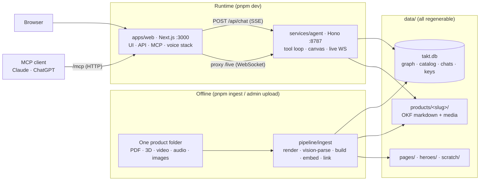
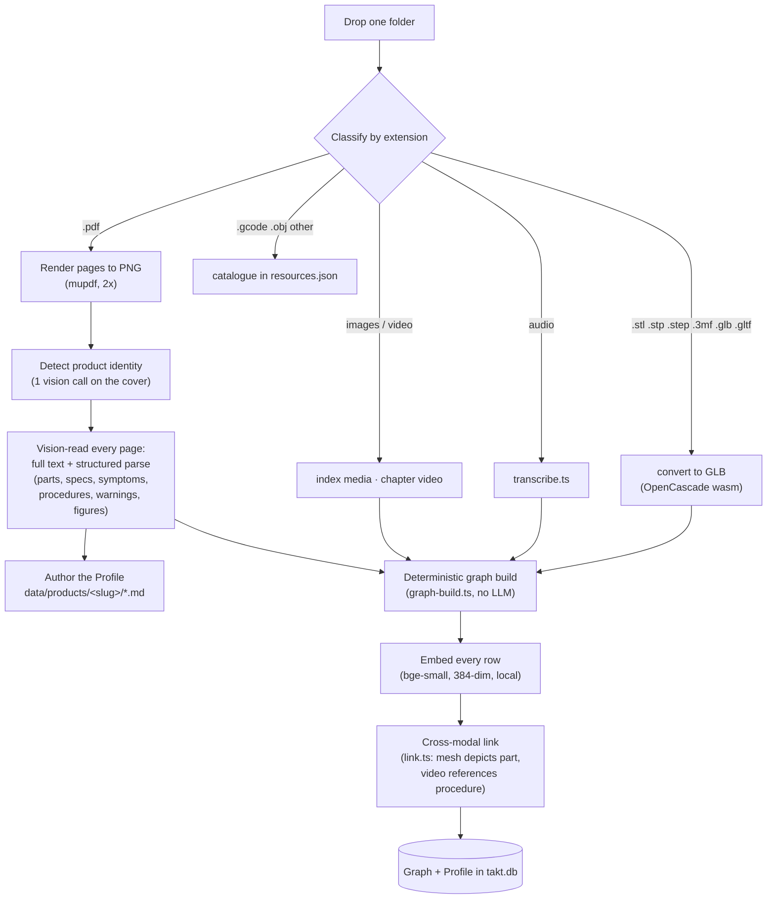
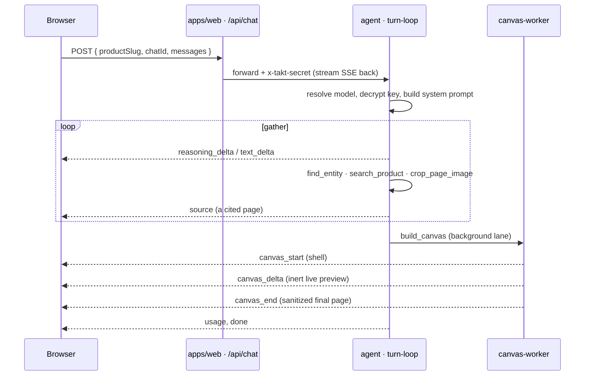
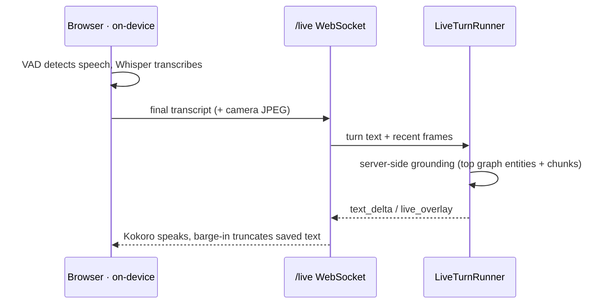

# Architecture

Takt has two runtime processes, one offline pipeline, and one SQLite file that holds
everything regenerable. This doc walks through the whole system: how ingestion builds the
knowledge graph, how the agent retrieves and answers, how the canvas gets composed, and how
live voice works.

## System at a glance



## Processes

Two processes run locally, started together by `pnpm dev`.

**Web** (`apps/web`, Next.js, :3000) owns the UI plus light API routes. It handles all CRUD
(products, providers, settings, chats) by talking directly to the SQLite file, serves
rendered page images and Profile media, renders the composed HTML canvas in a sandboxed
iframe (opaque origin, so the model's CSS/JS can never touch the app), proxies the chat
stream to the agent, and hosts the MCP server at `/mcp`. In production its custom server
(`server.mjs`) also proxies the `/live` WebSocket to the agent, attaching the shared secret.

**Agent** (`services/agent`, Hono, :8787) runs a provider-agnostic tool loop and streams
Server-Sent Events back. Its tools split into two lanes.

- **gather:** `find_entity` / `explore_entity` / `trace_path` (walk the graph),
  `search_product` (hybrid FTS + semantic over graph chunks), `get_media` (graph media),
  `read_profile`, `get_page_image`, `crop_page_image`, `list_products`, `fetch_url`.
- **canvas:** `build_canvas`, `edit_canvas`, `read_canvas`, `select_canvas`. The model writes
  one raw HTML page that a background canvas worker builds, and the finished, sanitized page
  lands on the stage.
- plus `update_todos`, `ask_user`, and (live voice only) `look` (grabs a fresh camera frame)
  and `show_overlay` (pins a 3D part / figure / clip / pointer note over the live view).

One gather loop (`turn-loop.ts`) and one canvas worker (`canvas-worker.ts`) serve chat. Live
voice runs its own per-call turn runner (`live/turn-runner.ts`) over the same tools. The web
proxy forwards a shared secret (`x-takt-secret`), and the agent rejects anything without it
when one is configured.

They're split because the agent is a long-lived Node process. It holds the model
conversation, streams SSE, reads the graph off a real filesystem, and runs the live-voice
WebSocket, none of which fits a serverless function. The split also makes hosting simple:
point `AGENT_SERVICE_URL` at a container.

## Ingestion: one folder to a knowledge graph

Ingestion is offline. Run it from the `/admin` console (Products & ingestion) or the CLI
(`pnpm ingest <folder>`). It scans the folder recursively, classifies each file by extension,
and builds both the Profile and the graph. Runtime does zero processing.



A few things worth knowing:

- **Page captions are cached** in the DB keyed by page, so re-ingesting an unchanged manual
  skips the expensive vision pass. The Profile bundle is rebuilt from scratch each run.
- **Every video is ingested** (each one chaptered into timestamped clips and linked), not
  only the first.
- **Audio is transcribed** (`transcribe.ts`) so spoken walkthroughs become searchable text.
- **3D files carry a subsystem.** The immediate parent folder name (`Frame/`, `Nextruder/`)
  becomes the part's subsystem, which helps the cross-modal linker attach meshes to the right
  parts even when names don't match exactly.
- **The build is deterministic.** No LLM runs in the compile, so the same part on five pages
  collapses to one node and re-ingest is stable. `replaceProductGraph` swaps a product's whole
  graph transactionally.

Vision (captioning, product detection, video chaptering) needs a provider key. Set the
ingestion model at `/admin` → Models & API keys, or pass `--provider` / `--model` to the CLI.
See [adding-a-product.md](adding-a-product.md) for the file-type table and flags.

## Data store

Product knowledge has two layers.

**Profile bundles** at `data/products/<slug>/` are folders of OKF-style markdown, one concept
per source, with captions inlined next to their page images. They're human-editable, and
`read_profile` serves them verbatim. `.index/media.json` beside them is the regenerable media
registry ingest writes (every `page` / `mesh` / `video_clip` / `image` with its `/assets` URL
and caption).

**The knowledge graph** is the retrieval substrate, in SQLite: typed `entities` (part, spec,
symptom, procedure, warning, figure, model_part, video_clip) with their measured values in
`attrs`, typed `edges` (`fixes`, `references`, `shown_in`, `depicts`), `kg_chunks` (page
text), and `kg_media`. Every row carries its own local embedding
(`Xenova/bge-small-en-v1.5`, 384-dim, no API key) plus FTS5 tables.

Retrieval is hybrid: FTS5 (BM25) fused with in-DB cosine by reciprocal-rank fusion, then
re-ranked so query-term coverage dominates. A chunk that contains all the question's
meaningful words beats one that's rich in a single common word. It degrades to lexical-only
when the embedder is unavailable.

The same SQLite file (`data/takt.db`, `better-sqlite3`) also holds app state:

- `products`, `manuals`, `page_images`: the catalog and rendered pages, with their vision
  captions.
- `providers`: the provider and its AES-256-GCM-encrypted key. Model and effort choices live
  in `settings`. Both are managed at `/admin`.
- `chats`, `messages`: conversation history (each turn's ordered blocks, including canvases,
  live turns flagged `live`).

Rendered page PNGs live in `data/pages/<manualId>/<n>.png`, Profile bundles in
`data/products/<slug>/`, and both are served by `/assets/[...path]`.

## Chat request flow



1. The browser POSTs `{ productSlug, chatId, messages, attachments? }` to `/api/chat`.
2. `/api/chat` forwards the body to the agent (with the shared secret) and streams the
   response back byte for byte. The client's abort signal is forwarded too, so pressing Stop
   tears down the upstream turn.
3. The agent resolves the model and decrypts the provider key, builds a product-aware system
   prompt, and runs its tool loop: resolve entities, search the graph, show pages, and write
   a raw HTML canvas. The canvas build runs on a background worker.
4. As the model streams, the agent emits SSE frames. Tools emit their own frames (a citation
   source, canvas deltas, a clarifying question) as side effects.
5. The browser decodes frames and updates the transcript. The canvas shows a page-shaped
   skeleton, then paints the streamed `canvas_delta` into the frame as an inert preview (so
   the page appears to build itself live), and swaps in the finished, sanitized document on
   `canvas_end`. The agent also accumulates the same frames into an ordered block list and
   persists it, so reopening a chat replays the turn exactly.

## Canvas: how an answer gets designed

The canvas quality comes from upstream constraints, the same trade claude.ai's Artifacts
make (they ship with no post-render verification). The compose model gets a blessed skeleton,
a forced plan-before-code contract, and a pre-validated chart palette, then writes one plain-
text HTML page between `<takt:canvas>` markers.

```
build_canvas / edit_canvas
  → read_design (modules)  →  PLAN (prose)  →  <takt:canvas> page </takt:canvas>
  → stop_reason max_tokens? → "continue where you stopped" (up to 2 rounds), concat
  → sanitize (asset allowlist, strip on*= and javascript:) + grep-lint + one self-correct
  → canvas_end → the paint, no post-render verify loop
```

An earlier version ran a Playwright + vision verify loop after the paint. It got deleted: it
silently no-op'd when chromium wasn't available, used the build model to judge its own output,
and only caught two geometry classes. The investment moved upstream, into the skeletons and
the plan-first contract, where it catches more for less.

The finished page renders in an `<iframe sandbox srcdoc>` with an opaque origin. Its CSS/JS
can't collide with or reach the app, and that isolation (not sanitization) is the security
boundary. Web-component islands (`takt-figure` / `takt-model` / `takt-video` / `takt-cite` /
`takt-action`) bridge clicks back to the app via postMessage, which is how a citation chip
opens the source page. Full standard in [design-standard.md](design-standard.md).

## Live voice

Live mode is a thick client. The browser runs the whole voice stack on-device via
transformers.js/ONNX: Silero VAD, Whisper STT, Smart-Turn end-of-turn detection, and Kokoro
TTS. No audio ever crosses the network. The `/live` WebSocket carries only final transcript
text (plus inline camera JPEGs), a cancel signal, and the chat SSE union coming back
(`packages/shared/src/live-events.ts`).



- **UI:** the composer morphs into a voice bar (same `layoutId`), the stage stays visible, the
  camera is a draggable PiP tile, and the spoken transcript lands in the chat rail as
  live-flagged turns. There's no separate live screen.
- **Server** (`services/agent/src/live/`): `ws.ts` attaches the WebSocket to the agent's HTTP
  server. One `LiveSession` per call persists turns (barge-in truncates the saved text to
  exactly what was voiced) and rehydrates history on reconnect. `LiveTurnRunner` drives the
  LLM with the product tools, camera frames on the two most recent turns, and lowest-latency
  reasoning.
- **Grounding:** every product-scoped turn is grounded server-side before the model speaks.
  The top matched graph entities (with their exact spec values) and chunks are injected into
  the turn, so a latency-tuned model answers "215 °C, page 50" without a tool round. Tools
  remain for anything deeper.
- **Overlays:** `show_overlay` pins one visual over the live view while the agent talks: the
  rotatable 3D part (`<model-viewer>`, with AR on phones), a manual figure, a repair clip, a
  pointer note, or marks drawn on the camera feed itself (arrows, rings, boxes, freehand
  paths, labels at normalized 0 to 1 coords, several per call). A 3D part or figure given an
  anchor pins inside the feed next to the thing it explains. It's screen-space annotation
  anchored to the frame, not object-tracked, and the agent re-aims as frames refresh each
  turn. Overlays are ephemeral: a new one replaces the last, `clear` takes it down, nothing
  persists.

## SSE protocol

One JSON object per `data:` line (defined in `packages/shared/src/sse-events.ts`):

| type | meaning |
|------|---------|
| `text_delta` | a chunk of assistant text |
| `reasoning_delta` | a chunk of streamed reasoning |
| `tool_start` / `tool_done` | a tool started / finished (drives the "Searching the manual…" hint), matched by id; `lane` tags main vs. background build |
| `source` | a manual page/crop cited as a source (opens in the source modal) |
| `canvas_start` / `canvas_delta` / `canvas_end` | the canvas: `canvas_start` opens the shell, `canvas_delta` carries the decoded HTML so far and is painted live as an inert preview, `canvas_end` delivers the authoritative sanitized + linted page |
| `canvas_error` | the canvas build failed; the client clears the skeleton |
| `canvas_highlight` | ring + scroll a canvas block into view by its `data-takt-id` (empty clears) |
| `live_overlay` | live voice: pin/replace/clear the visual over the live view |
| `action_result` | ack for an interactive canvas action (`takt-action`) |
| `ask_user` / `ask_answer` | a clarifying-question panel, and the answer streamed back |
| `title` | the generated chat title |
| `todos` | the agent's working checklist |
| `status` | a transient status line (e.g. "Designing the answer…"; live uses `ready` to end warm-up) |
| `usage` | per-turn context / output tokens and cost |
| `done` / `error` | end of turn |

The decoder (`createSseDecoder`) is stateful and frames on `\n\n`, so partial network chunks
are handled correctly.

## Why these choices

- **Graph compiled, markdown kept.** The graph is a deterministic compile artifact (same
  input, same graph), so it can be rebuilt any time, while the Profile markdown stays the
  human-readable, editable export of the same knowledge.
- **Hybrid retrieval with coverage re-rank.** FTS catches exact codes and part numbers,
  embeddings catch fuzzy symptoms in the user's words, and term-coverage keeps natural
  questions from drifting to a page that merely repeats one common word.
- **Vision-caption every page.** The manuals are mostly diagrams and tables. A vision pass
  turns each page into searchable text and structured entities (a spec's exact value ends up
  on the graph node even when the page text defers to an online table). The captions and parse
  are the quality moat.
- **Canvas in a sandboxed iframe.** The model writes one HTML page rendered with an opaque
  origin, so its CSS/JS can't reach the app. That isolation is the security boundary.
- **Voice on-device.** STT/TTS/VAD in the browser means privacy (no audio leaves the machine),
  zero server GPU cost, and local barge-in with no round-trip.
- **Everything under `data/` is regenerable.** Profile plus graph is the knowledge, the DB is
  one file, and `pnpm ingest` rebuilds it all.
