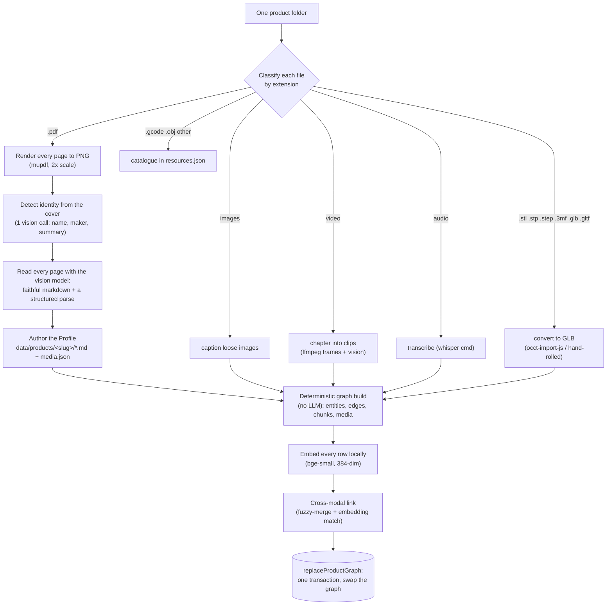

# Ingestion and storage

This is how Takt turns a folder of product docs into a knowledge graph, and where all of it
lives on disk. Ingestion is offline: run it once from the `/admin` console or the CLI, and the
runtime never processes anything. The output is a markdown Profile you can read plus a graph
the agent queries.

## The pipeline



The Profile (markdown) is written before the graph, and the graph build is best-effort. If
embedding or linking fails, the product still has its readable Profile and page images, just no
graph rows, so a bad run degrades instead of losing everything.

## Step by step

1. **Render.** Every PDF page is rendered to a PNG at 2x scale with `mupdf` (wasm, no native
   build), so small diagram labels stay legible. Embedded page text is pulled out too, for
   models that can't see images.
2. **Detect the product.** One vision call on the primary manual's cover fills in any name,
   manufacturer, or summary you didn't pass. Anything you passed on the command line or in the
   form wins.
3. **Read every page.** The vision model returns two things per page: a faithful markdown
   transcription (every table as a real GFM table with units, every diagram described) and a
   structured parse (below). Page captions are cached by a SHA-1 hash of the rendered PNG, so
   re-ingesting an unchanged manual skips the vision pass entirely.
4. **Author the Profile.** Takt writes `data/products/<slug>/`, a folder of OKF-style markdown,
   one file per source, with each page's image inlined above its transcription. This is the
   canonical, human-editable record, and it seeds the media registry.
5. **Build the graph** deterministically, with no LLM in the compile (details below).
6. **Embed** every entity, chunk, and media caption with a local model.
7. **Link** media across modalities (fuzzy name merge, then embedding match).
8. **Swap** the whole product graph in one SQLite transaction.

Videos, images, audio, and 3D files fold in alongside the PDFs. Every video is chaptered into
timestamped clips (ffmpeg samples frames, the vision model labels each span), not only the
first one. Audio is transcribed by whatever command you point `TAKT_WHISPER_CMD` at (for
example whisper.cpp). Both enter the graph as searchable text.

## What the vision model extracts per page

Each page comes back as one JSON object. This structured parse is what makes image-only
content queryable, and it's where a spec's exact value ends up even when the page text defers
to an online table.

| Field | What it captures |
|---|---|
| `textMd` | Full markdown transcription: body text, every table with units, a description of each diagram and its labeled parts |
| `parts` | `{ name, aliases (incl. plain-language), summary }` |
| `specs` | `{ name, value (number), unit, refHint (the part it belongs to) }` |
| `symptoms` | `{ name, aliases (layman words like "clicking noise"), summary, refHint (the fix) }` |
| `procedures` | `{ name, aliases, summary }` |
| `warnings` | `{ name, summary }` |
| `figures` | `{ label, caption describing the diagram and every labeled part }` |

Names are kept short and canonical so the same part matches across pages. The model is told
never to invent a part number or a value. Malformed JSON falls back to keeping the page
captioned, so nothing drops out of search.

## The deterministic graph build

No LLM runs here. The same input always produces the same graph, which is what makes re-ingest
stable and the graph trustworthy.

- **Entities** carry an id of `productId:type:slug(name)`. The same part named on five pages
  collapses to one node because the id is identical, and ids are namespaced by product so a
  shared part name across two products can't collide. The 14 entity types are `part`,
  `assembly`, `procedure`, `step`, `symptom`, `spec`, `warning`, `setting`, `compatibility`,
  `figure`, `region`, `model_part`, `video_clip`, `term`.
- **Edges** are typed relations, 11 of them: `part_of`, `connects_to`, `requires`, `fixes`,
  `causes`, `shown_in`, `located_on`, `compatible_with`, `step_of`, `references`, `depicts`.
  The build wires spec to part (`references`), procedure to symptom (`fixes`), part to figure
  (`shown_in`), and 3D part to real part (`depicts`).
- **Values** land in the entity's `attrs`, but only when they contain a digit. Qualitative
  fills like "very high" are dropped so grounding stays clean.
- **Chunks** (`kg_chunks`) are the page text: one per page, plus a caption chunk per page that
  has figures.
- **Media rows** (`kg_media`) are the figures, meshes, video clips, and loose images, each
  attached to the entity it depicts.

### Cross-modal linking

After the build and the embed, a two-pass cascade connects things whose names don't line up.

1. **Fuzzy merge** collapses near-duplicate entities of the same type. An alias that equals the
   other's name, or a Jaro-Winkler name similarity of 0.92 or higher, merges them. Three guards
   stop over-merging: skip labels under 4 characters, block when digit tokens differ (MK3 vs
   MK4, M3 vs M4), and block a general-vs-specific pair ("extruder" vs "extruder gear").
2. **Embedding cross-modal link** attaches a 3D part or video clip that shares no name with any
   entity to its nearest topical entity by cosine similarity (threshold 0.55), as a `depicts`
   edge for meshes or `references` for clips. Unanchored media gets pointed at its nearest
   entity the same way.

So a mesh named `x-carriage-back-r2.stl` in a `Nextruder/` folder becomes an "X Carriage Back"
model part and links to the real part even if the manual never spells it identically.

## 3D, video, audio conversion

- **3D:** GLB and glTF pass through. STL is converted by a small dependency-free writer (it
  even rotates Z-up to glTF's Y-up and applies a matte material). STEP goes through the
  OpenCascade wasm tessellator (`occt-import-js`), and 3MF is unzipped and parsed with `fflate`.
  When one part ships in several formats, Takt keeps one, preferring GLB over STL over 3MF over
  STEP. The immediate parent folder name becomes the part's subsystem.
- **Video:** ffprobe reads the duration, ffmpeg samples about 12 frames, and the vision model
  labels contiguous spans as `{ tStart, tEnd, part, caption }`. If ffmpeg or vision isn't
  available, the whole video becomes a single clip.
- **Audio:** shelled out to `TAKT_WHISPER_CMD`. The transcript enters the graph as page-kind
  chunk text (no entities are extracted from audio).

## Storage

Everything regenerable lives under `data/`. Nothing there is committed; it all rebuilds from
`pnpm ingest`.

```
data/
  takt.db              SQLite: catalog, graph, chats, encrypted keys, settings
  seed.db              committed key-free template, copied to takt.db on first boot
  pages/<manualId>/    rendered page PNGs (1-indexed)
  pdfs/<filename>      the original PDFs
  heroes/<slug>.<ext>  product hero images
  products/<slug>/     the OKF Profile bundle (below)
  scratch/             the agent's per-turn writable tmp (crops, working files)
  .enc-key             the key-encryption key (auto-created, 0600)
```

A Profile bundle is plain markdown:

```
products/<slug>/
  overview.md          product frontmatter + a Sources list
  <concept>.md         one file per source; page image inlined above its transcription
  index.md             an OKF listing, grouped by type
  media/               converted meshes, videos, and images
  .index/media.json    the regenerable media registry the graph build reads
  resources.json       catalogued gcode / obj / other (not ingested)
```

### The database

One SQLite file (`better-sqlite3`, WAL mode) holds the catalog and the graph. The schema is
idempotent and applied on every open. The knowledge tables:

- `products`, `manuals`, `page_images`: the catalog and rendered pages, with each page's cached
  caption and structured parse. `page_images.png_hash` is the byte-identity key that lets an
  unchanged page skip re-captioning. The `manuals` table also holds non-PDF sources (web pages,
  YouTube, audio) keyed by URL.
- `entities`, `edges`: the typed graph. `entities.attrs_json` carries measured values.
- `kg_chunks`, `kg_media`: page text and media, each optionally attached to an entity.
- Three FTS5 tables (`entities_fts`, `chunks_fts`, `media_fts`): the BM25 lexical index.
- `providers`, `settings`, `chats`, `messages`: keys, model choices, and conversation history.

**Embeddings live in the database, not a separate vector file.** Each `entities`, `kg_chunks`,
and `kg_media` row carries its own `embedding` BLOB (384-dim Float32, little-endian), written
by a local model (`Xenova/bge-small-en-v1.5`, no API key). At query time these load into a
per-product in-memory vector store and get cosine-ranked, fused with the FTS results by
reciprocal-rank fusion, then re-ranked so a chunk that covers all the question's meaningful
words beats one that just repeats a common word. When the embedder isn't available, ingest and
retrieval both fall back to lexical-only.

### Provider keys

Provider API keys are encrypted at rest with AES-256-GCM, stored as `iv:tag:ciphertext`. The
key-encryption key comes from `TAKT_ENC_KEY` or an auto-created `data/.enc-key` (mode 0600).
Plaintext keys never leave the server; the UI only ever sees the last 4 characters.

### Re-ingest is transactional

`replaceProductGraph` deletes a product's entities, edges, chunks, media, and FTS rows, then
inserts the fresh graph, all in one transaction. A re-ingest never leaves orphan rows or stale
text, and a crash mid-swap rolls back cleanly. Deleting a product runs the same swap with an
empty graph, then drops the row.

To wipe everything locally, `pnpm db:reset` clears `takt.db` and the media directories. To
clear the catalog but keep your provider keys and model choices, the ingest package has a
guarded `reset-catalog` path.

## Cost and re-runs

Captioning is the only paid step (product detection, page reads, video chaptering). A typical
48-page manual is a few minutes and a few cents. Because captions are cached by page hash,
re-ingesting an unchanged manual is nearly free. The `/admin` form shows an estimate before any
paid work runs. See [adding-a-product.md](adding-a-product.md) for the file-type table and the
CLI flags, and [architecture.md](architecture.md) for how retrieval uses all of this at query
time.
