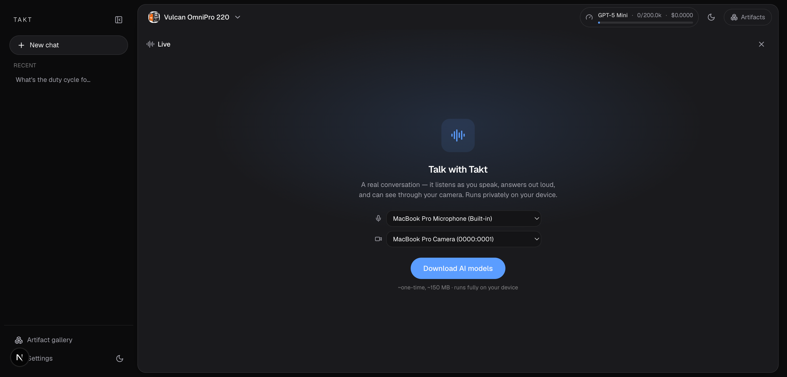
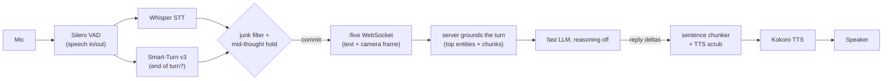
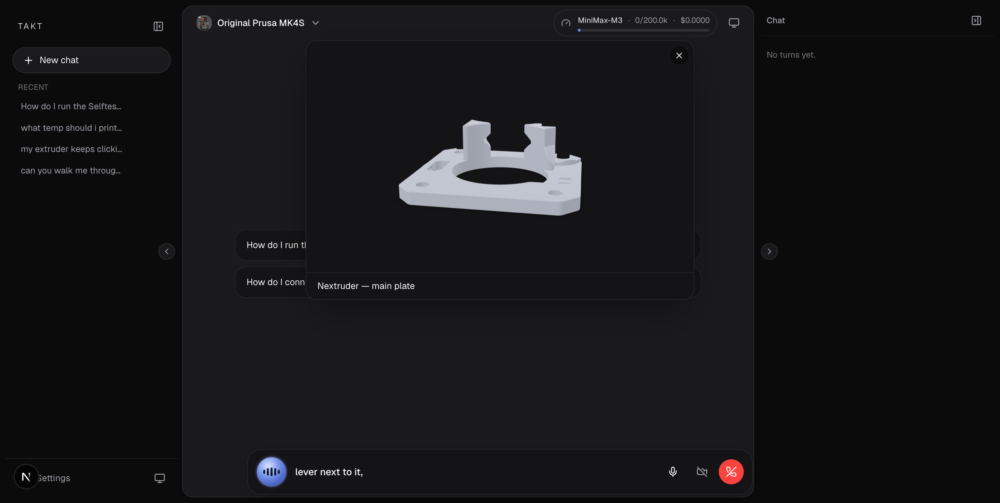

# Live voice mode

Live mode is a real conversation with your product manual. You talk, Takt listens, answers out
loud, and can watch your camera and pin visuals over what you're holding. The whole voice stack
runs on-device in your browser, so no audio ever leaves your machine. The server only ever sees
text and the occasional camera frame.

## How a turn flows

Everything left of the WebSocket runs in a Web Worker in your browser. The worker stays warm for
the whole tab, so reopening a call is instant.

## The on-device stack

Four models do the voice work. They download once (the UI shows real MB and a per-model
checklist), cache in the browser, and run on WebGPU when available or fall back to WASM/CPU.

| Job | Model | Notes |
|---|---|---|
| Voice activity (speech in/out) | Silero VAD v5 (`@ricky0123/vad-web`) | assets served same-origin so it works offline |
| Speech to text | `whisper-base.en` (WebGPU) or `whisper-tiny.en` (WASM) | English-only variants, picked for product-term accuracy |
| End of turn | Smart-Turn v3 (`pipecat-ai/smart-turn-v3`) | semantic, not just silence; reads the last 8s of audio |
| Text to speech | Kokoro-82M v1.0 (voice `af_heart`) | streams PCM at 24kHz |

On WebGPU the models run in fp32 and warm up with one dummy inference each to compile shaders,
so the first real turn isn't janky. On phones (WASM) that warm-up is skipped on purpose, because
the extra buffer allocation is what OOM-crashes real devices mid-download. If there's no WebGPU,
the pre-call screen says so plainly ("responses will be slower on CPU").

## Knowing when you're done talking

Getting the turn boundary right is most of what makes a voice call feel natural.

- **Silero VAD** segments speech, tuned to end a little eagerly (about 550ms of silence) because
  two backstops catch premature endings.
- **Smart-Turn v3** decides semantically whether you actually finished, not just whether you went
  quiet. If it says "not done," the utterance is held and merged with your next words.
- **Mid-thought hold.** If your last word is a trailing filler or preposition ("set it to..."),
  Takt waits for the rest. Digits are kept, so "set it to 250" ends on "250", not on "to".
- **A noise gate** learns the room's noise floor while you're idle and clamps it so it can't
  creep up and swallow a soft talker.
- **A junk filter** drops Whisper's silence hallucinations ("thanks for watching", "please
  subscribe") while keeping real short answers like "okay", "yeah", and "bye".

## Interrupting it (barge-in)

Start talking while Takt is speaking and it stops immediately. The cut is decided locally, with
no server round-trip, so it feels instant.

The saved transcript is truncated to exactly what you actually heard. Takt counts a chunk of the
reply as "spoken" only when it actually starts playing, so the sentence it had synthesized ahead
but never voiced doesn't get saved as if it were said. The server keeps only that spoken prefix,
and history stays clean: you, then it, then you.

The trick that makes this reliable is echo cancellation. The reply audio is routed through a
hidden `<audio>` element that Chrome's echo canceller can see (Web Audio output alone is invisible
to it), so the agent's own voice is removed from the mic and can't trigger a false interruption.

## Talking as it thinks

Takt starts speaking before the full answer is written. A sentence chunker releases the first
speakable clause fast (a low character bar for the opening chunk), then merges later short
sentences up to a stable length so Kokoro gets text long enough to render with a steady voice.

Before anything is spoken, the text is scrubbed so symbols don't get read aloud: links become
their text, markdown marks and list bullets are stripped, citation tokens like `[p.18]` are
removed, provider control-token noise is filtered, and photo narration is rewritten into natural
speech ("in the image" becomes "here").

## Grounded before it speaks

A latency-tuned fast model would happily invent a plausible-looking page citation. So every
product-scoped turn is grounded on the server before the model says a word.

Takt runs a quick search of the product's graph (top entities and chunks, a few milliseconds of
local SQLite) and injects the exact matches, with their values and page numbers, into the turn:
"answer with these EXACT values and cite the page." Entities go first because the graph is the
authority, so the model can say "215 °C, page 50" without a tool round. Filler turns ("thanks,
sounds good") skip the injection so they don't get noisy facts attached. Tools remain available
for anything deeper.

Reasoning is off in live mode, at every layer (no effort sent, reasoning models forced to
minimal, reasoning deltas dropped, inline `<think>` scrubbed), because thinking time is dead air
on a call. The turn is capped at a few steps for the same reason, and tool calls in a step run
concurrently. On session open the model's prompt cache is primed with a tiny request, so the
first spoken turn is a cache hit.

A canvas the agent builds during a call runs in the background on a signal that never aborts, so
interrupting the spoken turn doesn't kill a page that's landing on the stage.

## Seeing what you show it

Turn the camera on and Takt watches. It defaults to the rear camera on phones. Frames ride along
inline with your transcript (about one per second, most recent attached), and only the last two
turns keep their images so cost and latency stay bounded.

The **`look`** tool grabs a fresh, higher-resolution frame on demand (1280px vs the 640px rolling
samples) so the model can read a small label or serial number when it needs to. If the camera is
off, it asks you to turn it on rather than guessing.

Not every model can see. MiniMax models are voice-only (their endpoint takes no images), so the
model picker warns "can't see, pick a vision model" and Takt prefers a vision-capable provider
for live when one has a key.

## Showing you things while it talks

The **`show_overlay`** tool pins one visual over your camera view while the agent explains. It's
the remote-expert surface. Overlays are ephemeral: a new one replaces the last, and `clear` takes
it down. Nothing persists.

| Overlay | What it is |
|---|---|
| `model` | the rotatable 3D part (`<model-viewer>`), with AR placement on phones (WebXR / Scene Viewer / Quick Look) |
| `figure` | the exact manual figure or photo |
| `video` | a repair clip, autoplaying in a floating card |
| `note` | a short labeled pin at a point on the feed |
| `marks` | arrows, rings, boxes, freehand paths, and labels drawn on the camera feed |
| `clear` | takes the current overlay down |

Marks are placed at normalized 0-to-1 coordinates, up to 8 per call, so the agent can point an
arrow right at the lever it's describing ("that one, right here"). A 3D part or figure given an
anchor pins inside the feed next to the thing it explains, instead of floating above the stage.

Because the camera is handheld, a small on-device tracker follows the marked spot at about 10fps
using template matching (no ML), nudging the graphics to stay on target and clearing them once
the target leaves the view. The agent re-aims by redrawing on the next turn's fresh frame. And it
always speaks first: the prompt makes it say a line before it pins anything and talk you through
the visual.

## The interface

The composer and the voice bar are the same dock, animated between shapes with a shared layout
transition, so entering and leaving a call feels continuous. The stage stays visible behind the
call the whole time.

- **The orb** shows the call's state through color (green listening, blue speaking, amber
  working) and pulses to a real spectrum of the live voice, folded into a symmetric waveform. It
  respects reduced-motion.
- **The voice bar** shows a karaoke subtitle that reveals a few words at a time, paced to the
  actual audio, plus mute, camera, and end-call controls.
- **The camera tile** is a draggable, resizable picture-in-picture that floats above everything
  and hosts the overlays and the mark tracker.
- **The transcript** lands in the chat rail as live-flagged turns, reduced through the same
  pipeline as typed chat, so tool chips, sources, and canvases all show up. The text reveal is
  paced to the audio, so it never runs ahead of what you've heard, which keeps it honest on
  barge-in.

## Careful on phones

Live mode is built to survive real mobile hardware. During the model download the pre-call camera
preview and mic audio context are released, so their memory isn't stacked under about 150MB of
model weights (that stacking is what crashes phones mid-download). They remount once the models
are ready. On iOS, the audio context is unlocked synchronously inside the Start tap (iOS blocks
audio started after an await), and the backdrop-dismiss guard requires the press to both start and
end on the backdrop, because iOS Safari otherwise retargets a tap when the button under it is
removed mid-gesture.

## Session and reconnect

A session is created per call. The chat row is created lazily on your first spoken turn, so
opening and closing a call never litters the sidebar with empty chats, and it auto-titles from
what you first said. Every turn is persisted with a live flag (even a barge-in-truncated one), so
reloading shows the call exactly. On reconnect, the last 20 turns are seeded back so the agent
doesn't forget mid-call. The client reconnects a few times with backoff. When you end the call, a
single teardown releases the mic, camera, and audio, but the voice worker is deliberately left
warm so the next call starts instantly.

Live errors are always spoken, never silent. Quota, auth, and network failures are mapped to
friendly in-call messages so a call never just goes quiet and stuck.

## The /live protocol

The WebSocket at `/live` carries text and camera frames, never audio. Messages are JSON
discriminated unions, with one binary path for the on-demand `look` frame.

**Browser to server:** `user_text` (the finished turn plus the freshest camera frame inline),
`cancel` (barge-in, with what was actually voiced), `control` (`camera_on` / `camera_off` /
`end`), and `frame_response` (answering a `look` request, the JPEG follows as a binary frame).

**Server to browser:** `sse` (an ordinary chat SSE event wrapped so the browser reuses the same
chat reducer, so the whole SSE union comes back verbatim, including `live_overlay`), `need_frame`
(request a fresh hi-res frame for `look`), and `error`.

The upgrade requires the shared `x-takt-secret` from the trusted web proxy. `?product=<slug>`
scopes the call to one product's graph, and no product (or "master") runs a cross-product
session.

## Choosing a live model

Live has its own model setting at `/admin`, separate from chat, so you can run a fast model here
while chat uses a stronger one. The curated fast picks are `claude-haiku-4-5` (vision, about 600ms
to first token), `gpt-5-mini` / `gpt-5-nano`, and MiniMax's highspeed models (voice-only). The
picker still lets you choose any model; it just warns when the one you picked can't see the camera.
See [architecture.md](architecture.md) for how live fits the rest of the system.
